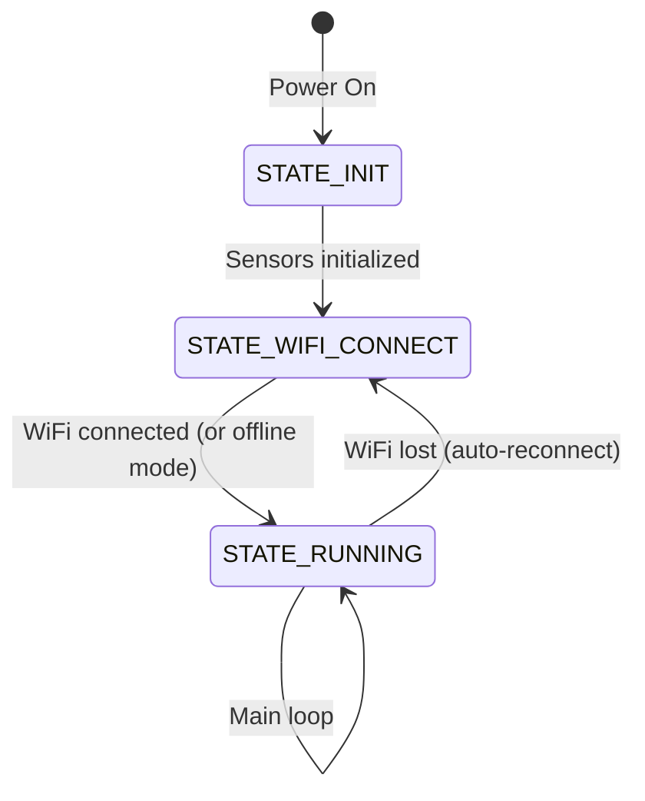

# IoT Health Monitor — Complete Hardware & Firmware Guide

> [!IMPORTANT]
> This guide covers **everything** you need to wire, program, and troubleshoot the ESP8266-based health monitoring system with MAX30102, DS18B20, and GSR sensors.

---

## 1. Wiring Diagram

### Pin Map (ESP8266 NodeMCU → Sensors)

| Sensor | Sensor Pin | ESP8266 Pin | GPIO | Notes |
|---|---|---|---|---|
| **MAX30102** | SDA | **D2** | GPIO4 | I2C Data |
| | SCL | **D1** | GPIO5 | I2C Clock |
| | VIN | **3.3V** | — | ⚠ Do NOT use 5V if your module lacks an on-board regulator |
| | GND | **GND** | — | Common ground |
| **DS18B20** | DATA (Yellow) | **D4** | GPIO2 | OneWire data line |
| | VCC (Red) | **3.3V** | — | Can also use 5V (sensor is 3–5.5V) |
| | GND (Black) | **GND** | — | Common ground |
| | **4.7kΩ resistor** | Between DATA and VCC | — | **REQUIRED** pull-up resistor |
| **GSR Sensor** | SIG | **A0** | ADC0 | Analog output (0–3.3V) |
| | VCC | **3.3V** | — | Power supply |
| | GND | **GND** | — | Common ground |

### Visual Wiring Layout

```
                    ┌──────────────────────┐
                    │   ESP8266 NodeMCU    │
                    │                      │
   MAX30102         │  3.3V ──────┬────────┤ 3.3V
   ┌──────┐         │             │        │
   │  SDA ├─────────┤ D2 (GPIO4)  │        │
   │  SCL ├─────────┤ D1 (GPIO5)  │        │
   │  VIN ├─────────┤─────────────┘        │
   │  GND ├─────────┤ GND ────────┬────────┤ GND
   └──────┘         │             │        │
                    │             │        │
   DS18B20          │             │        │
   ┌──────┐    ┌──┐ │             │        │
   │ DATA ├────┤R ├─┤ D4 (GPIO2)  │        │         R = 4.7kΩ
   │  VCC ├────┤  ├─┤─────── 3.3V─┘        │         (between DATA
   │  GND ├────┴──┘─┤ GND ────────┘        │          and VCC)
   └──────┘         │                      │
                    │                      │
   GSR Sensor       │                      │
   ┌──────┐         │                      │
   │  SIG ├─────────┤ A0                   │
   │  VCC ├─────────┤ 3.3V                 │
   │  GND ├─────────┤ GND                  │
   └──────┘         │                      │
                    └──────────────────────┘
```

### Voltage Considerations

| Component | Operating Voltage | Safe with 3.3V? | Notes |
|---|---|---|---|
| ESP8266 | 3.3V logic | ✔ Native | **Never** feed 5V to GPIO pins |
| MAX30102 | 1.8V core, 3.3V I2C | ✔ Yes | Most breakout boards have on-board LDO; connect VIN to 3.3V |
| DS18B20 | 3.0–5.5V | ✔ Yes | Works on 3.3V; pull-up goes to VCC (3.3V) |
| GSR Sensor | 3.3–5V | ✔ Yes | SIG output must not exceed 3.3V for ESP8266 ADC |

> [!WARNING]
> The ESP8266 ADC (A0) is rated **0–1.0V** internally, but NodeMCU boards include a built-in voltage divider mapping 0–3.3V → 0–1.0V. If using a bare ESP-12E module (not NodeMCU), add an external voltage divider.

---

## 2. Required Libraries

Install these through **Arduino IDE → Sketch → Include Library → Manage Libraries** (or via PlatformIO):

| Library | Author | Version | Install Search Term |
|---|---|---|---|
| **SparkFun MAX3010x** | SparkFun Electronics | ≥ 1.1.2 | `SparkFun MAX3010x` |
| **OneWire** | Paul Stoffregen | ≥ 2.3.7 | `OneWire` |
| **DallasTemperature** | Miles Burton | ≥ 3.9.0 | `DallasTemperature` |
| **ESP8266WiFi** | ESP8266 Community | (built-in) | Comes with board package |
| **ESP8266HTTPClient** | ESP8266 Community | (built-in) | Comes with board package |

### Board Manager Setup (if not done)

1. Open **Arduino IDE → File → Preferences**
2. Add to **Additional Board Manager URLs**:
   ```
   https://arduino.esp8266.com/stable/package_esp8266com_index.json
   ```
3. Go to **Tools → Board → Board Manager** → search `ESP8266` → install **esp8266 by ESP8266 Community** (v3.x)
4. Select board: **Tools → Board → NodeMCU 1.0 (ESP-12E Module)**
5. Settings:
   - CPU Frequency: **80 MHz**
   - Flash Size: **4MB (FS:2MB OTA:~1019KB)**
   - Upload Speed: **115200**

---

## 3. Full Arduino Code

The complete firmware is located at:

[health_monitor.ino](file:///c:/Users/gupta/Desktop/iot-health-monitor/arduino/health_monitor/health_monitor.ino)

### Code Architecture Overview



### Key Design Decisions

| Feature | Implementation | Why |
|---|---|---|
| Heart rate detection | SparkFun `checkForBeat()` with 8-sample moving average | Proper peak detection; raw register reads are unreliable |
| SpO2 calculation | Red/IR ratio → linear calibration | Good approximation without full DFT; matches clinical literature |
| Temperature reads | Non-blocking (`setWaitForConversion(false)`) | DS18B20 takes 750ms at 12-bit; blocking would stall the loop |
| GSR noise reduction | 10-sample ADC averaging + EMA smoothing | Analog readings are inherently noisy; double filtering eliminates jitter |
| Watchdog safety | `yield()` in every tight loop + `delay(10)` in main loop | ESP8266 crashes if WiFi/watchdog doesn't get serviced for ~3 seconds |

### Configuration — Change Before Upload

Open [health_monitor.ino](file:///c:/Users/gupta/Desktop/iot-health-monitor/arduino/health_monitor/health_monitor.ino) and edit these three lines:

```cpp
const char* WIFI_SSID     = "YOUR_WIFI_SSID";
const char* WIFI_PASSWORD  = "YOUR_WIFI_PASSWORD";
const char* SERVER_URL     = "http://YOUR_BACKEND_IP:8000/api/v1/predict";
```

---

## 4. Troubleshooting

### 4.1 MAX30102 Not Detecting / No Heart Rate

| Symptom | Cause | Fix |
|---|---|---|
| "MAX30102 NOT found on I2C bus!" | Wiring error or wrong I2C pins | Verify SDA→D2, SCL→D1. Run I2C scanner sketch |
| Heart rate always 0 | Finger not pressed firmly | Press fingertip (not nail) firmly on sensor window |
| Erratic BPM readings | Finger moving during measurement | Hold finger still for 10+ seconds. Avoid pressing too hard (restricts blood flow) |
| I2C bus hangs | Long wires, no pull-ups | Use short wires (< 15cm). MAX30102 breakouts usually have built-in pull-ups |

**I2C Scanner Sketch** — Use this to verify the sensor is visible:

```cpp
#include <Wire.h>
void setup() {
  Serial.begin(115200);
  Wire.begin(4, 5);  // SDA=D2, SCL=D1
}
void loop() {
  for (byte addr = 1; addr < 127; addr++) {
    Wire.beginTransmission(addr);
    if (Wire.endTransmission() == 0) {
      Serial.print("Found device at 0x");
      Serial.println(addr, HEX);
    }
  }
  Serial.println("Scan complete.");
  delay(5000);
}
```

MAX30102 should appear at **0x57**.

---

### 4.2 DS18B20 Returning -127°C

| Symptom | Cause | Fix |
|---|---|---|
| -127.0°C | Sensor not detected on OneWire bus | Check DATA wire to D4, verify 4.7kΩ pull-up |
| 85.0°C | Power-on reset value (conversion not complete) | Code handles this; if persistent, check power supply quality |
| Intermittent -127°C | Loose connection or long cable | Solder connections; keep cable < 1m for 3.3V operation |
| "DS18B20 NOT found!" | Wrong pin or missing pull-up | ① Verify GPIO2 (D4) ② Add 4.7kΩ between DATA and 3.3V |

**4.7kΩ Pull-up is NON-OPTIONAL:**

```
     3.3V
      │
     [4.7kΩ]
      │
      ├──── DATA pin (D4)
      │
   DS18B20 DATA
```

> [!TIP]
> If you don't have a 4.7kΩ resistor, two 10kΩ resistors in parallel (= 5kΩ) work acceptably. Values from 4.0kΩ to 10kΩ are usually fine.

---

### 4.3 Noisy GSR Readings

| Symptom | Cause | Fix |
|---|---|---|
| Values jumping wildly | Single-sample ADC noise | Code uses 10-sample averaging + EMA (already handled) |
| Very high resistance (>1MΩ) | Fingers not touching electrodes | Ensure both fingers are firmly on the GSR pads |
| Zero or near-zero reading | Short circuit or wrong wiring | Check SIG→A0, VCC→3.3V, GND→GND |
| Readings affected by mains hum | 50/60 Hz interference | Keep GSR wires short; twist signal and ground wires together |

**GSR Electrode Tips:**
- Clean and dry fingers before measurement
- Use index and middle finger on the same hand
- Apply consistent, light pressure (not too tight)
- Wait 10–15 seconds for readings to stabilize

---

### 4.4 I2C Connection Failures

| Symptom | Cause | Fix |
|---|---|---|
| I2C bus hangs (ESP8266 freezes) | SDA/SCL stuck LOW | Power-cycle the ESP8266 + sensor |
| Sensor found but data = 0 | Wrong register configuration | Use SparkFun library (handles register setup) |
| Multiple I2C errors in Serial | Clock speed too high | Code uses 400kHz; try reducing to 100kHz: `Wire.setClock(100000)` |
| I2C conflicts with GPIO2 (boot pin) | DS18B20 on GPIO2 can affect boot | Add a 10kΩ pull-up on GPIO2 to ensure it's HIGH during boot |

> [!NOTE]
> GPIO2 (D4) must be HIGH during ESP8266 boot. The 4.7kΩ pull-up for DS18B20 naturally satisfies this requirement. If boot fails, ensure no other device pulls GPIO2 LOW during power-on.

---

### 4.5 ESP8266 Watchdog Resets / Crashes

| Symptom | Cause | Fix |
|---|---|---|
| `wdt reset` in Serial Monitor | Code blocked for > 3 seconds without `yield()` | All loops in the firmware include `yield()` calls |
| `Soft WDT reset` | Long I2C transaction or WiFi operation | `delay(10)` at end of [loop()](file:///c:/Users/gupta/Desktop/iot-health-monitor/arduino/health_monitor/health_monitor.ino#619-706) ensures OS tasks run |
| Stack overflow | Too many local variables or deep recursion | Avoid large arrays on stack; use `static` or `global` |
| Random reboots | Insufficient power supply | Use a **good quality** USB cable and a 5V/1A+ power source |

---

## 5. Serial Monitor Output Example

Set baud rate to **115200** in Arduino IDE Serial Monitor:

```
====================================
  IoT Health Monitor — Booting...
====================================

[154] Initialising MAX30102 pulse oximeter...
[312] ✔ MAX30102 detected
[315] Initialising DS18B20 temperature sensor...
[467] ✔ DS18B20 found (1 device(s))
[468] ✔ GSR sensor ready on A0

Sensor Status:
  MAX30102 (HR/SpO2) : READY
  DS18B20  (Temp)    : READY
  GSR      (Stress)  : READY (analog)

[470] Connecting to WiFi: MyNetwork
..........
[5512] ✔ WiFi connected — IP: 192.168.1.42
[5515] Setup complete — entering main loop

╔══════════════════════════════════════════╗
║       IoT HEALTH MONITOR DASHBOARD      ║
╠══════════════════════════════════════════╣
║  ♥ Heart Rate     : 76.3 BPM            ║
║  ☁ SpO2           : 97.4 %              ║
║  🌡 Body Temp      : 36.72 °C            ║
║  ⚡ GSR Resistance : 342.5 kΩ            ║
║  🫁 Resp. Rate     : 16.9 br/min         ║
╠══════════════════════════════════════════╣
║  MAX30102: ✔ OK  |  DS18B20: ✔ OK  |  GSR: ✔  ║
║  WiFi: ✔ 192.168.1.42                   ║
╚══════════════════════════════════════════╝
```

---

## 6. Component Checklist

| # | Component | Qty | Purpose |
|---|---|---|---|
| 1 | ESP8266 NodeMCU (ESP-12E) | 1 | Microcontroller + WiFi |
| 2 | MAX30102 Pulse Oximeter Module | 1 | Heart rate + SpO2 |
| 3 | DS18B20 Waterproof Temperature Sensor | 1 | Body temperature |
| 4 | GSR Sensor Module | 1 | Stress / skin conductivity |
| 5 | 4.7kΩ Resistor | 1 | Pull-up for DS18B20 |
| 6 | Breadboard + Jumper Wires | 1 set | Prototyping connections |
| 7 | Micro-USB Cable (data-capable) | 1 | Power + programming |

> [!CAUTION]
> Some cheap Micro-USB cables are **charge-only** (no data lines). If the Arduino IDE can't detect the COM port, try a different cable.

---

## 7. Quick Start Checklist

- [ ] Wire all sensors per the pin map above
- [ ] Add 4.7kΩ pull-up resistor for DS18B20
- [ ] Install Arduino IDE board package for ESP8266
- [ ] Install libraries: SparkFun MAX3010x, OneWire, DallasTemperature
- [ ] Open [health_monitor.ino](file:///c:/Users/gupta/Desktop/iot-health-monitor/arduino/health_monitor/health_monitor.ino) and set WiFi credentials + server URL
- [ ] Select board: **NodeMCU 1.0 (ESP-12E Module)**
- [ ] Upload and open Serial Monitor at **115200 baud**
- [ ] Place finger firmly on MAX30102 and verify readings
- [ ] Start backend server and confirm data arrives at `/api/v1/predict`
